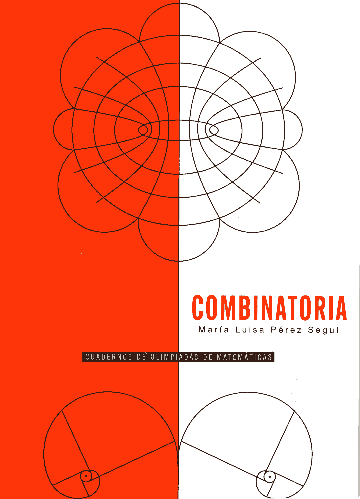

# Combinatoria

📚 Cuadernos de olimpiadas de matemáticas 🗓 2018 ℹ️ Publicado

 

## Resumen
Resumen 2

## Ediciones disponibles

    

        <button type="button" class="edition-button active" data-target="edicion-cuad-x-1-0">Edición 2</button>
    

    

        
<h3>Edición 2</h3><ul><li><strong>Año:</strong> 2018</li><li><strong>Editorial:</strong> Instituto de Matemáticas, UNAM</li><li><strong>ISBN:</strong> 978-607-02-85882</li></ul>

    

## Metadatos
|  |  |
|---|---|
| Autores | Maria Luisa Pérez Seguí |
| Colección | Cuadernos de olimpiadas de matemáticas |
| Año | 2018 |
| Editorial | Instituto de Matemáticas, UNAM |
| Edición | 2 |
| ISBN (Colección) | 978-968-36-8599-5 |
| ISBN (Texto) | 978-607-02-85882 |

## Descargas
<a class="md-button data-book-id=cuad-x-1 download-link" data-book-id="cuad-x-1" href = "cuad-x-1_mark.pdf" target = "_blank" rel ="noopener" > Abrir PDF </a>
<a class="md-button  data-book-id=cuad-x-1 download-link" data-book-id="cuad-x-1" href ="cuad-x-1_mark.pdf" download> Descargar</a>

 Ver en línea (vista previa)

<object data = "cuad-x-1_mark.pdf" type="application/pdf" width="100%" height="700" >

 Tu navegador no puede mostrar PDF incrustado <a href="cuad-x-1_mark.pdf" target="_blank" rel ="noopener"> Abrir PDF </a> o usa el botón "Descargar".

</object>

!!! info "Aviso"
    Documento con marca de agua para distribución **digital**.

## Cómo citar
> Maria Luisa Pérez Seguí. (2018). *Combinatoria*. Instituto de Matemáticas, UNAM, 2

BibTeX

<textarea id="myInput" rows="6" cols="80" class="verbatim">
@BOOK{cuad-x-1, 
title = {Combinatoria}, 
author = {Pérez, Maria}, 
year = {2018}, 
publisher = {Instituto de Matemáticas, UNAM}, 
address = {México}}
</textarea>
 
<button style ="cursor:pointer; background-color: #ecf3ff; color: #448aff; padding: 3px 6px; border-radius: 6px; text-align: center" onclick="myFunction()">Copiar BibTeX</button>

[Volver al catálogo](../catalogo.md)

[Explorar](../explorar.md)
