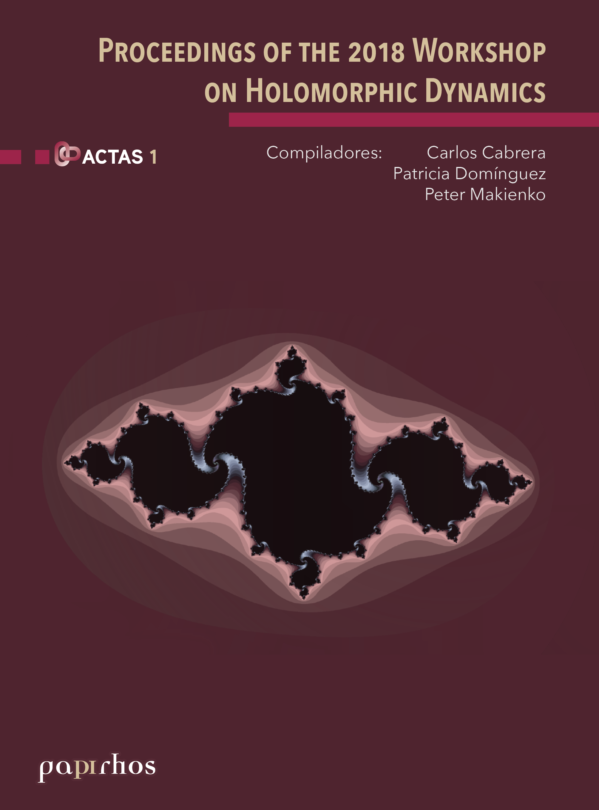

# Proceedings of the Workshop on Holomorphic Dynamics

🏷 Actas 📚 Papirhos ℹ️ Físico

 

## Resumen
Resumen proximamente

## Ediciones disponibles

    

        <button type="button" class="edition-button active" data-target="edicion-pap-act-1-0">Edición sin especificar</button>
    

    

        
<h3>Edición sin especificar</h3><ul><li><strong>Editorial:</strong> Instituto de Matemáticas, UNAM</li></ul>

    

## Metadatos
|  |  |
|---|---|
| Autores | Patricia Dominguez Soto, Peter Makienko, Carlos Cabrera Ocañas |
| Colección | Papirhos |
| Serie | Actas |
| Editorial | Instituto de Matemáticas, UNAM |
| ISBN (Colección) | 000 |

## Descargas
<a class="md-button data-book-id=pap-act-1 download-link" data-book-id="pap-act-1" href = "pap-act-1_mark.pdf" target = "_blank" rel ="noopener" > Abrir PDF </a>
<a class="md-button  data-book-id=pap-act-1 download-link" data-book-id="pap-act-1" href ="pap-act-1_mark.pdf" download> Descargar</a>

 Ver en línea (vista previa)

<object data = "pap-act-1_mark.pdf" type="application/pdf" width="100%" height="700" >

 Tu navegador no puede mostrar PDF incrustado <a href="pap-act-1_mark.pdf" target="_blank" rel ="noopener"> Abrir PDF </a> o usa el botón "Descargar".

</object>

!!! info "Aviso"
    Documento con marca de agua para distribución **digital**.

## Cómo citar
> Patricia Dominguez Soto, Peter Makienko, Carlos Cabrera Ocañas. *Proceedings of the Workshop on Holomorphic Dynamics*. Instituto de Matemáticas, UNAM

BibTeX

<textarea id="myInput" rows="6" cols="80" class="verbatim">
@BOOK{pap-act-1, 
title = {Proceedings of the Workshop on Holomorphic Dynamics}, 
author = {Dominguez, Patricia and Makienko, Peter and Cabrera, Carlos}, 
year = {}, 
publisher = {Instituto de Matemáticas, UNAM}, 
address = {México}}
</textarea>
 
<button style ="cursor:pointer; background-color: #ecf3ff; color: #448aff; padding: 3px 6px; border-radius: 6px; text-align: center" onclick="myFunction()">Copiar BibTeX</button>

[Volver al catálogo](../catalogo.md)

[Explorar](../explorar.md)
