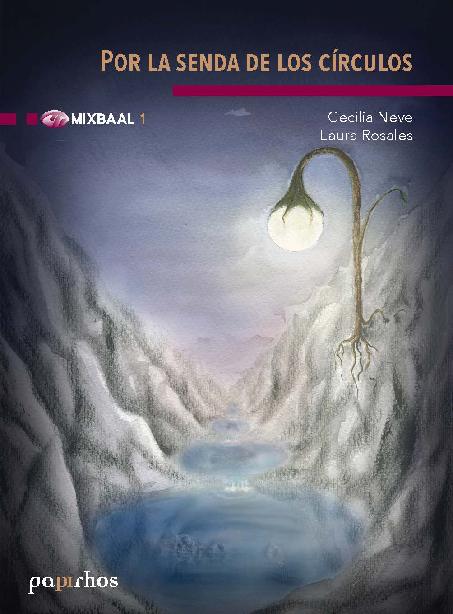

# Por la senda de los círculos

🏷 Mixbaal 📚 Papirhos ℹ️ por recibir

 

## Resumen
Resumen proximamente

## Metadatos
|  |  |
|---|---|
| Autores | Cecilia Neve Jimenez, Laura Rosales Ortiz |
| Colección | Papirhos |
| Serie | Mixbaal |

## Descargas
<a class="md-button data-book-id=pap-mix-1 download-link" data-book-id="pap-mix-1" href = "pap-mix-1_mark.pdf" target = "_blank" rel ="noopener" > Abrir PDF </a>
<a class="md-button  data-book-id=pap-mix-1 download-link" data-book-id="pap-mix-1" href ="pap-mix-1_mark.pdf" download> Descargar</a>

 Ver en línea (vista previa)

<object data = "pap-mix-1_mark.pdf" type="application/pdf" width="100%" height="700" >

 Tu navegador no puede mostrar PDF incrustado <a href="pap-mix-1_mark.pdf" target="_blank" rel ="noopener"> Abrir PDF </a> o usa el botón "Descargar".

</object>

!!! info "Aviso"
    Documento con marca de agua para distribución **digital**.

## Cómo citar
> Cecilia Neve Jimenez, Laura Rosales Ortiz. *Por la senda de los círculos*. 

BibTeX

<textarea id="myInput" rows="6" cols="80" class="verbatim">
@BOOK{pap-mix-1, 
title = {Por la senda de los círculos}, 
author = {Neve, Cecilia and Rosales, Laura}, 
year = {}, 
publisher = {}, 
address = {México}}
</textarea>
 
<button style ="cursor:pointer; background-color: #ecf3ff; color: #448aff; padding: 3px 6px; border-radius: 6px; text-align: center" onclick="myFunction()">Copiar BibTeX</button>

[Volver al catálogo](../catalogo.md)

[Explorar](../explorar.md)
