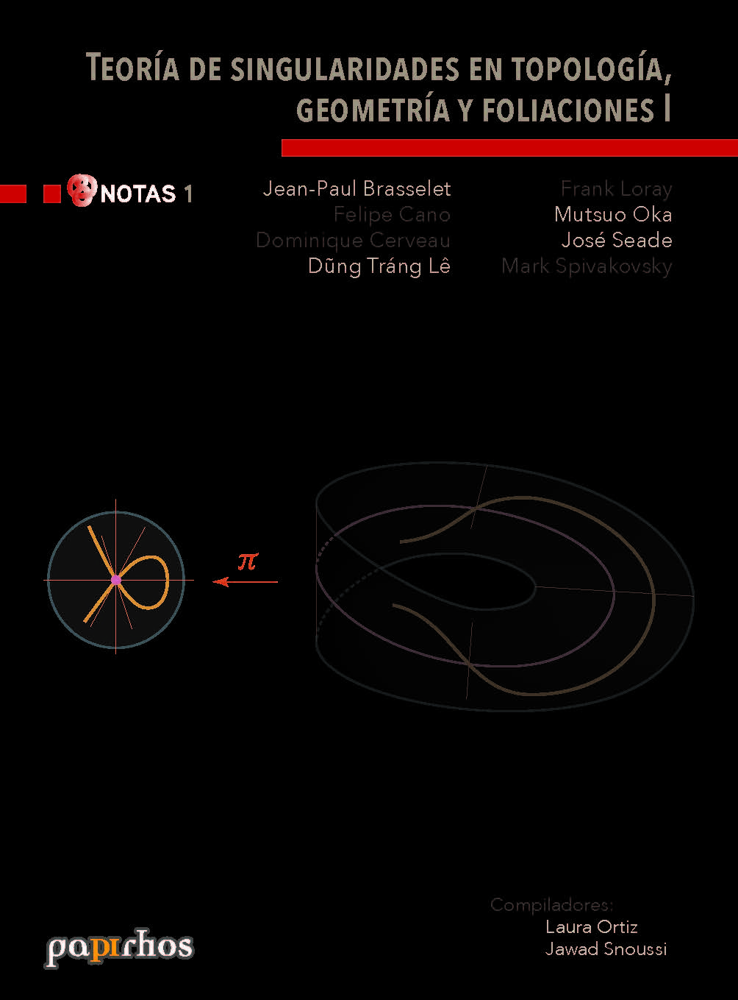

# Teoría de singularidades en topología, geometría y foliaciones I

🏷 Notas 📚 Papirhos 🗓 2017 ℹ️ Publicado

 

## Resumen
Resumen proximamente

## Ediciones disponibles
### Edición 1

- **Año:** 2017
- **Editorial:** Instituto de Matemáticas, UNAM
- **ISBN:** 978-607-02-9845-5

## Metadatos
|  |  |
|---|---|
| Autores | Jean-Paul Brasselet, Felipe Cano, Dominique Cerveau, Dung Tráng Lê, Frank Loray, Mutsuo Oka, José Seade, Mark Spivakovsky |
| Colección | Papirhos |
| Serie | Notas |
| Año | 2017 |
| Editorial | Instituto de Matemáticas, UNAM |
| Edición | 1 |
| ISBN (Colección) | 978-607-02-5149-8 |
| ISBN (Texto) | 978-607-02-9845-5 |

## Descargas
<a class="md-button data-book-id=pap-not-1 download-link" data-book-id="pap-not-1" href = "pap-not-1_mark.pdf" target = "_blank" rel ="noopener" > Abrir PDF </a>
<a class="md-button  data-book-id=pap-not-1 download-link" data-book-id="pap-not-1" href ="pap-not-1_mark.pdf" download> Descargar</a>

 Ver en línea (vista previa)

<object data = "pap-not-1_mark.pdf" type="application/pdf" width="100%" height="700" >

 Tu navegador no puede mostrar PDF incrustado <a href="pap-not-1_mark.pdf" target="_blank" rel ="noopener"> Abrir PDF </a> o usa el botón "Descargar".

</object>

!!! info "Aviso"
    Documento con marca de agua para distribución **digital**.

## Cómo citar
> Jean-Paul Brasselet, Felipe Cano, Dominique Cerveau, Dung Tráng Lê, Frank Loray, Mutsuo Oka, José Seade, Mark Spivakovsky. (2017). *Teoría de singularidades en topología, geometría y foliaciones I*. Instituto de Matemáticas, UNAM, 1

BibTeX

<textarea id="myInput" rows="6" cols="80" class="verbatim">
@BOOK{pap-not-1, 
title = {Teoría de singularidades en topología, geometría y foliaciones I}, 
author = {Brasselet, Jean-Paul and Cano, Felipe and Cerveau, Dominique and Lê, Dung and Loray, Frank and Oka, Mutsuo and Seade, José and Spivakovsky, Mark}, 
year = {2017}, 
publisher = {Instituto de Matemáticas, UNAM}, 
address = {México}}
</textarea>
 
<button style ="cursor:pointer; background-color: #ecf3ff; color: #448aff; padding: 3px 6px; border-radius: 6px; text-align: center" onclick="myFunction()">Copiar BibTeX</button>

[Volver al catálogo](../catalogo.md)

[Explorar](../explorar.md)
