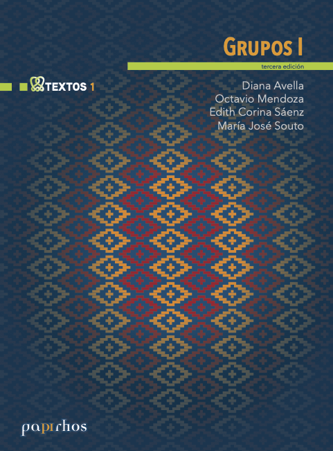

# Grupos I

🏷 Textos 📚 Papirhos 🗓 2014 ℹ️ Publicado

 

## Resumen
Resumen 5

## Ediciones disponibles

    

        <button type="button" class="edition-button active" data-target="edicion-pap-tex-1-0">Edición 3</button>
    

    

        
<h3>Edición 3</h3><ul><li><strong>Año:</strong> 2014</li><li><strong>Editorial:</strong> Instituto de Matemáticas, UNAM</li><li><strong>ISBN:</strong> 978-607-02-9435-8</li></ul>

    

## Metadatos
|  |  |
|---|---|
| Autores | Diana Avella, Octavio Mendoza, Edith Corina Saenz Valadez, María José Souto |
| Colección | Papirhos |
| Serie | Textos |
| Tomo | 1 |
| Año | 2014 |
| Editorial | Instituto de Matemáticas, UNAM |
| Edición | 3 |
| ISBN (Colección) | 978-607-02-9375-7 |
| ISBN (Texto) | 978-607-02-9435-8 |

## Descargas
<a class="md-button data-book-id=pap-tex-1 download-link" data-book-id="pap-tex-1" href = "pap-tex-1_mark.pdf" target = "_blank" rel ="noopener" > Abrir PDF </a>
<a class="md-button  data-book-id=pap-tex-1 download-link" data-book-id="pap-tex-1" href ="pap-tex-1_mark.pdf" download> Descargar</a>

 Ver en línea (vista previa)

<object data = "pap-tex-1_mark.pdf" type="application/pdf" width="100%" height="700" >

 Tu navegador no puede mostrar PDF incrustado <a href="pap-tex-1_mark.pdf" target="_blank" rel ="noopener"> Abrir PDF </a> o usa el botón "Descargar".

</object>

!!! info "Aviso"
    Documento con marca de agua para distribución **digital**.

## Cómo citar
> Diana Avella, Octavio Mendoza, Edith Corina Saenz Valadez, María José Souto. (2014). *Grupos I*. Instituto de Matemáticas, UNAM, 3

BibTeX

<textarea id="myInput" rows="6" cols="80" class="verbatim">
@BOOK{pap-tex-1, 
title = {Grupos I}, 
author = {Avella, Diana and Mendoza, Octavio and Saenz, Edith and Souto, María}, 
year = {2014}, 
publisher = {Instituto de Matemáticas, UNAM}, 
address = {México}}
</textarea>
 
<button style ="cursor:pointer; background-color: #ecf3ff; color: #448aff; padding: 3px 6px; border-radius: 6px; text-align: center" onclick="myFunction()">Copiar BibTeX</button>

[Volver al catálogo](../catalogo.md)

[Explorar](../explorar.md)
