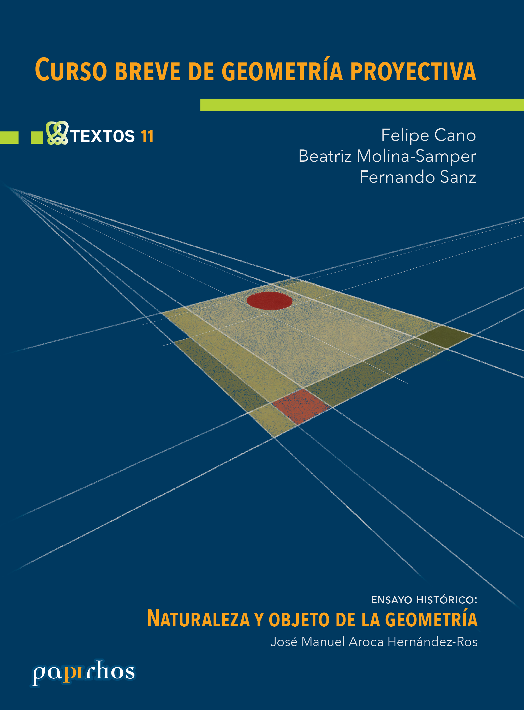

# Curso breve de geometría proyectiva

🏷 Textos 📚 Papirhos ℹ️ Físico

 

## Resumen
Resumen proximamente

## Ediciones disponibles

    

        <button type="button" class="edition-button active" data-target="edicion-pap-tex-11-0">Edición sin especificar</button>
    

    

        
<h3>Edición sin especificar</h3><h4>Metadatos</h4>
<table>
    <tbody>
        <tr><th>Autores</th><td>Felipe Cano, Beatriz Molina-Samper, Fernando Sanz</td></tr><tr><th>Colección</th><td>Papirhos</td></tr><tr><th>Serie</th><td>Textos</td></tr><tr><th>Editorial</th><td>Instituto de Matemáticas, UNAM</td></tr><tr><th>ISBN (Colección)</th><td>000</td></tr>
    </tbody>
</table>
<h4 class="citation-title">Cómo citar</h4>
<blockquote id="cita-ed-014">Felipe Cano, Beatriz Molina-Samper, Fernando Sanz. <em>Curso breve de geometría proyectiva</em>. Instituto de Matemáticas, UNAM.</blockquote><button type="button" class="citation-copy-button" data-target="cita-ed-014">Copiar cita</button>

BibTeX
<textarea id="bibtex-ed-014" rows="9" cols="80" class="verbatim">@BOOK{ed-014,
title = {Curso breve de geometría proyectiva},
author = {Cano, Felipe and Molina-Samper, Beatriz and Sanz, Fernando},
publisher = {Instituto de Matemáticas, UNAM},
address = {México}
}</textarea> <button type="button" class="bibtex-copy-button" data-target="bibtex-ed-014">Copiar BibTeX</button>

    

## Descargas
<a class="md-button data-book-id=pap-tex-11 download-link" data-book-id="pap-tex-11" href = "pap-tex-11_mark.pdf" target = "_blank" rel ="noopener" > Abrir PDF </a>
<a class="md-button  data-book-id=pap-tex-11 download-link" data-book-id="pap-tex-11" href ="pap-tex-11_mark.pdf" download> Descargar</a>

 Ver en línea (vista previa)

<object data = "pap-tex-11_mark.pdf" type="application/pdf" width="100%" height="700" >

 Tu navegador no puede mostrar PDF incrustado <a href="pap-tex-11_mark.pdf" target="_blank" rel ="noopener"> Abrir PDF </a> o usa el botón "Descargar".

</object>

[Volver al catálogo](../catalogo.md)

[Explorar](../explorar.md)
