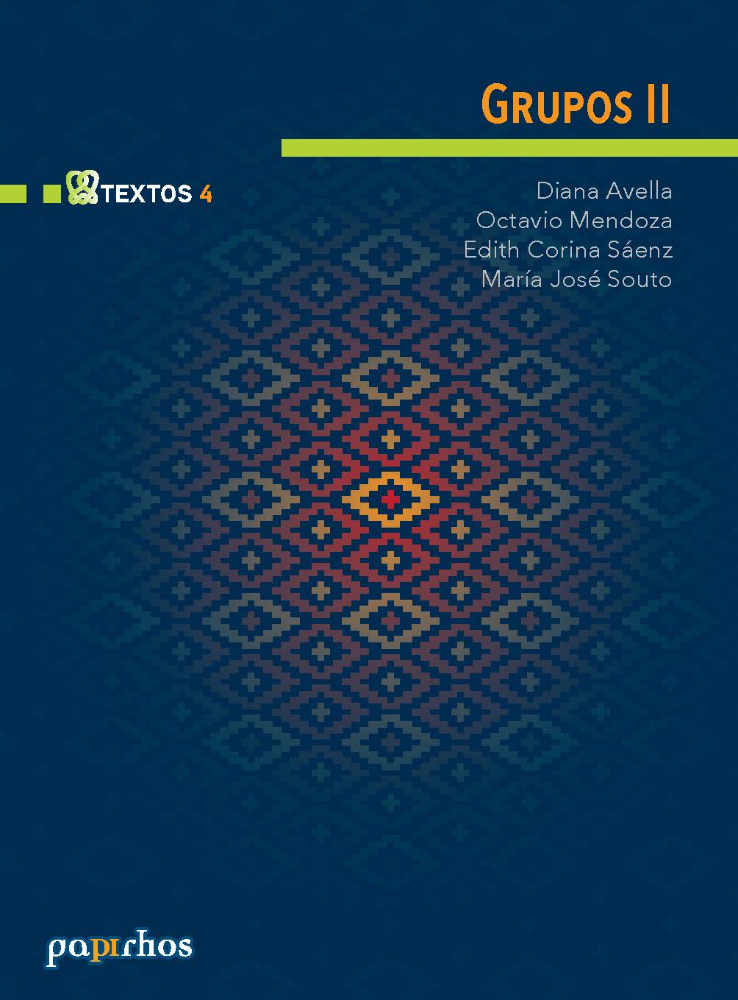

# Grupos II

🏷 Textos 📚 Papirhos 🗓 2016 ℹ️ Publicado

 

## Resumen
Resuemn 6

## Ediciones disponibles
### Edición 1

- **Año:** 2016
- **Editorial:** Instituto de Matemáticas, UNAM
- **ISBN:** 978-607-02-7814-3

## Metadatos
|  |  |
|---|---|
| Autores | Diana Avella, Octavio Mendoza, Edith Corina Saenz Valadez, María José Souto |
| Colección | Papirhos |
| Serie | Textos |
| Tomo | 2 |
| Año | 2016 |
| Editorial | Instituto de Matemáticas, UNAM |
| Edición | 1 |
| ISBN (Colección) | 978-607-02-5149-8 |
| ISBN (Texto) | 978-607-02-7814-3 |

## Descargas
<a class="md-button data-book-id=pap-tex-4 download-link" data-book-id="pap-tex-4" href = "pap-tex-4_mark.pdf" target = "_blank" rel ="noopener" > Abrir PDF </a>
<a class="md-button  data-book-id=pap-tex-4 download-link" data-book-id="pap-tex-4" href ="pap-tex-4_mark.pdf" download> Descargar</a>

 Ver en línea (vista previa)

<object data = "pap-tex-4_mark.pdf" type="application/pdf" width="100%" height="700" >

 Tu navegador no puede mostrar PDF incrustado <a href="pap-tex-4_mark.pdf" target="_blank" rel ="noopener"> Abrir PDF </a> o usa el botón "Descargar".

</object>

!!! info "Aviso"
    Documento con marca de agua para distribución **digital**.

## Cómo citar
> Diana Avella, Octavio Mendoza, Edith Corina Saenz Valadez, María José Souto. (2016). *Grupos II*. Instituto de Matemáticas, UNAM, 1

BibTeX

<textarea id="myInput" rows="6" cols="80" class="verbatim">
@BOOK{pap-tex-4, 
title = {Grupos II}, 
author = {Avella, Diana and Mendoza, Octavio and Saenz, Edith and Souto, María}, 
year = {2016}, 
publisher = {Instituto de Matemáticas, UNAM}, 
address = {México}}
</textarea>
 
<button style ="cursor:pointer; background-color: #ecf3ff; color: #448aff; padding: 3px 6px; border-radius: 6px; text-align: center" onclick="myFunction()">Copiar BibTeX</button>

[Volver al catálogo](../catalogo.md)

[Explorar](../explorar.md)
